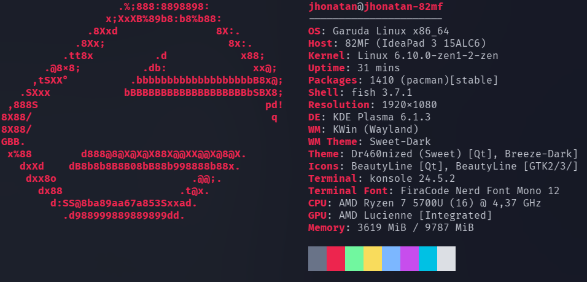

# Fish terminal

Customizing My Terminal with Fastfetch

## 1. Check your config file

I'm using Garuda Linux with Fish terminal as my default. To ensure your terminal recognizes the changes, you need to know which config file it is using. You can find it at `~/.config/fish/config.fish`

By default, my `config.fish` looks like this:
```bash
if status --is-interactive && type -q fastfetch
   fastfetch --config neofetch.jsonc
end
```

For some reason, it was using Neofetch instead of Fastfetch, so I changed it. In my case, the Fastfetch directory was empty, so I needed to create the config file. If the config file does not exist at `~/.config/fastfetch/fastfetch.jsonc`, use the command `fastfetch --gen-config` to generate it.

Here's the updated `config.fish`:
```bash
if status --is-interactive && type -q fastfetch
   fastfetch --config ~/.config/fastfetch/config.jsonc # that file
end
```

## 2. Old terminal

By default, the Fastfetch config file looks something like this:

```json
    {
  "$schema": "https://github.com/fastfetch-cli/fastfetch/raw/dev/doc/json_schema.json",
  "modules": [
    "title",
    "separator",
    "os",
    "host",
    "kernel",
    "uptime",
    "packages",
    "shell",
    "display",
    "de",
    "wm",
    "wmtheme",
    "theme",
    "icons",    
    "font",
    "cursor",
    "terminal",
    "terminalfont",
    "cpu",
    "gpu",
    "memory",
    "swap",
    "disk",
    "localip",
    "battery",
    "poweradapter",
    "locale",
    "break",
    "colors"
  ]
}
```

This is how it looks on terminal:<br>




## 3. New Terminal

After reading the [documentation](https://github.com/fastfetch-cli/fastfetch) on GitHub and looking for references, I changed the file to this:

```json
{
    "$schema": "https://github.com/fastfetch-cli/fastfetch/raw/dev/doc/json_schema.json",
    "logo": {
        "source": "~/.config/fastfetch/gojo.txt"
    },
    "display": {
        "separator": " ➜  "
    },
    "modules": [
        "break",
        {
            "type": "title",
            "keyWidth": 10
        },
        {
            "type": "custom",
            "format": "\u001b[31m┌────────────────────────────────────────┐"
        },
        "break",
        {
            "type": "os",
            "key": "OS   ",
            "keyColor": "31" // = color1
        },
        {
            "type": "kernel",
            "key": " ├  ",
            "keyColor": "31"
        },
        {
            "type": "packages",
            "format": "{} (pacman)",
            "key": " ├ 󰏖 ",
            "keyColor": "31"
        },
        {
            "type": "shell",
            "key": " └  ",
            "keyColor": "31"
        },
        "break",
        {
            "type": "wm",
            "key": "WM   ",
            "keyColor": "32"
        },
        {
            "type": "wmtheme",
            "key": " ├ 󰉼 ",
            "keyColor": "32"
        },
        {
            "type": "cursor",
            "key": " ├  ",
            "keyColor": "32"
        },
        {
            "type": "terminal",
            "key": " ├  ",
            "keyColor": "32"
        },
        {
            "type": "terminalfont",
            "key": " └  ",
            "keyColor": "32"
        },
        "break",
        {
            "type": "host",
            "format": "{5} {1}",
            "key": "PC   ",
            "keyColor": "33"
        },
        {
            "type": "cpu",
            "format": "{1} ({3}) @ {7}",
            "key": " ├  ",
            "keyColor": "33"
        },
        {
            "type": "gpu",
            "format": "{1} {2}",
            "key": " ├ 󰢮 ",
            "keyColor": "33"
        },
        {
            "type": "memory",
            "key": " ├  ",
            "keyColor": "33"
        },  
        {
            "type": "swap",
            "key": " ├ 󰓡 ",
            "keyColor": "33"
        },
        {
            "type": "disk",
            "key": " ├ 󰋊 ",
            "keyColor": "33"
        },
        {
            "type": "battery",
            "key": " └  ",
            "keyColor": "33"
        },
        {
            "type": "custom",
            "format": "\u001b[31m└────────────────────────────────────────┘"
        },
        "break",
        {
            "type": "custom",
            "format": "\u001b[90m     \u001b[31m     \u001b[32m     \u001b[33m     \u001b[34m     \u001b[35m     \u001b[36m     \u001b[37m   "
        }
    ]
}
```

And the result looks like this:<br>


About the ASCII art, you can see in the "logo" tag that I created a "gojo.txt" file with the ASCII art in the same directory. You can also use a .png picture instead by changing the "logo" tag.